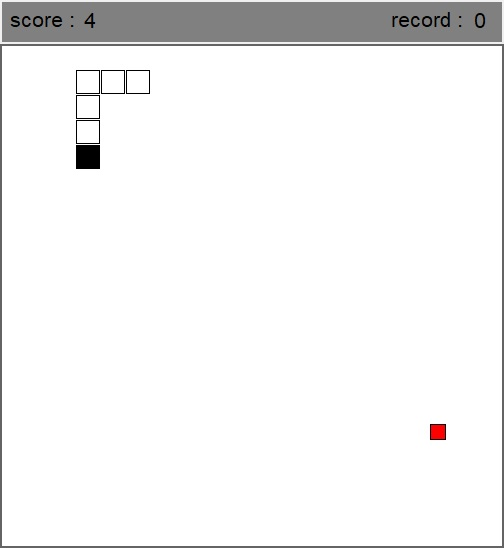

# Python-Snake-Game

This is a Snake game.
## Features
- Score and highscore counter
## Installation
1. Download the repository by clicking on `Code > Download ZIP`
2. Extract the ZIP file
3. Run `main.pyw`
## Requirements
- Python 3.7
- Python tkinter library
- Python random library
## Usage
You can start a game using the `ENTER` key and move the snake using the arrow keys.